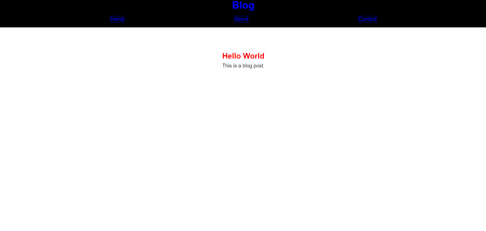
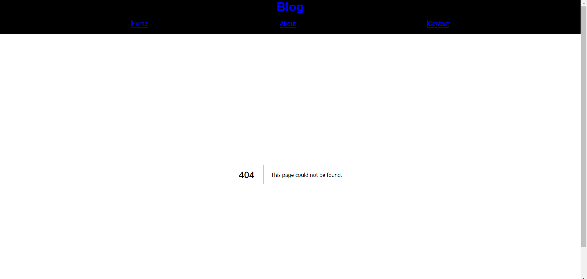

<h1 style="text-align: center;">Poc 5 - React</h1>

Rodrigo Mello | RA: 10409316

## Estrutura de Projeto Next.js 14 ou Superior

React + Next.js são frameworks que facilitam a criação de aplicações React com renderização do lado do servidor, otimizando o tempo de carregamento da página. Para criar um novo projeto, use o comando:

    npx create-next-app@(<versão> ou "latest" para última versão)

Após executar o comando, você deve escolher algumas opções sobre seu projeto, como:

- Nome do projeto
- Usar TypeScript em vez de JavaScript
- Usar Tailwind CSS
- Usar ESLint
- Entre outras

### Principais Arquivos

#### package.json

Esse arquivo contém todas as configurações e dependências do projeto. Exemplo:

    {
        "name": "poc-5",
        "version": "0.1.0", 
        "private": true,
        "scripts": {
            "dev": "next dev",
            "build": "next build",
            "start": "next start",
            "lint": "next lint"
        },
        "dependencies": {
            "react": "^18",
            "react-dom": "^18",
            "next": "14.2.15"
        }
    }

#### page.js

Arquivo da página raiz do projeto. Por padrão, ele cria uma página com a logo do Next.js e alguns links para documentação.

#### layout.js

Arquivo responsável pela padronização do conteúdo das páginas. Exemplo:

    export default function RootLayout({ children }) {
      return (
       <html lang="en">
         <body>
           <HeaderComponent/>
           {children}
         </body>
       </html>
     );
    }

O parâmetro `{children}` representa o conteúdo das páginas filhas. Nesse caso, como foi temos o HeaderComponent antes do`{children}`, Esse componente aparece acima do conteúdo da página. 

## Criação de Componentes Simples (Sem Estado)

Componentes simples em React são funções que retornam elementos JSX. Exemplo de um componente de cabeçalho:

    export default function HeaderComponent(){
    return (
        <header className={styles.header}>
            <h1 className={styles.title}>Blog</h1>
            

                <Link href="/" className={styles.redirects}>Home</Link>
                <Link href="/about" className={styles.redirects}>About</Link>
                <Link href="/contact" className={styles.redirects}>Contact</Link>
            

        </header>
    );    
}

## Estilo CSS (Global e Módulo)

### CSS Global

O arquivo `globals.css` é usado para estilizações globais que se aplicam a toda a aplicação.

    body {
      margin: 0;
      font-family: Arial, sans-serif;
    }

### CSS Módulo

CSS Módulo permite a modularização dos estilos, isolando a estilização de cada componente. Exemplo:

    .header {
        background-color: black;
        color: blue;
        display: flex;
        flex-direction: column;
    }

    .container {
        display: flex;
        justify-content: space-evenly;
        padding: 1rem;
    }

    .redirects {
        color: blue;
        text-decoration: none;
        margin: 0 1rem;
        border-style: solid;
        border-width: 1px;
        border-color: blue;
    }

    .title {
        color: blue;
        text-align: center;
    }

Com isso, você pode criar estilos específicos para cada componente sem afetar outros componentes.

## Prints

A página inicial de exemplo para minha POC possui o código:

    export default function Home() {
      return (
        PostComponent({title: "Hello World", content: "This is a blog post."})
      );
    }

E layout:

    export default function RootLayout({ children }) {
        return (
            <html lang="en">
                <body className={`${geistSans.variable} ${geistMono.variable}`}>
                    <HeaderComponent/>
                    {children}
                </body>
            </html>
        );
    }

Dessa forma ele possui um Header que é um componente presente em todas as páginas e um post presente apenas nela.
Print:

Print 404:

